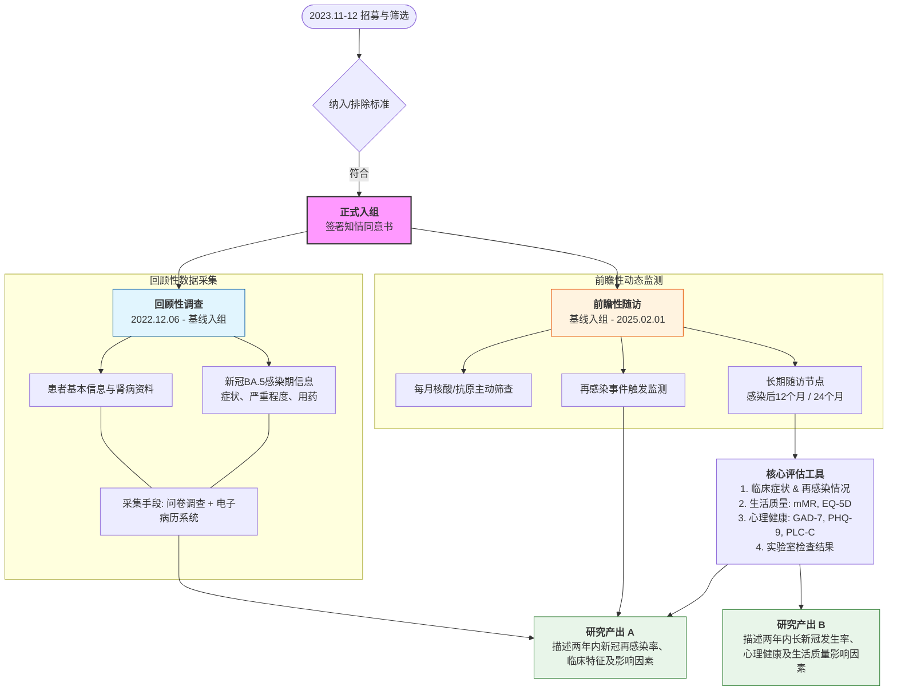

```mermaid
graph TD
    %% 顶部：筛选与入组
    Start([2023.11-12 招募与筛选]) --> Criteria{纳入/排除标准}
    Criteria -->|符合| Enroll[<b>正式入组</b><br/>签署知情同意书]

    %% 分支：回顾与前瞻
    Enroll --> Retro[<b>回顾性调查</b><br/>2022.12.06 - 基线入组]
    Enroll --> Prosp[<b>前瞻性随访</b><br/>基线入组 - 2025.02.01]

    %% 回顾性详情
    subgraph 回顾性数据采集
    Retro --> R1[患者基本信息与肾病资料]
    Retro --> R2[新冠BA.5感染期信息<br/>症状、严重程度、用药]
    R1 & R2 --- R_Method[采集手段: 问卷调查 + 电子病历系统]
    end

    %% 前瞻性详情
    subgraph 前瞻性动态监测
    Prosp --> P1[每月核酸/抗原主动筛查]
    Prosp --> P2[再感染事件触发监测]
    Prosp --> P3[长期随访节点<br/>感染后12个月 / 24个月]
    end

    %% 核心指标与量表汇总
    P3 --> Scales[<b>核心评估工具</b><br/>1. 临床症状 & 再感染情况<br/>2. 生活质量: mMR, EQ-5D<br/>3. 心理健康: GAD-7, PHQ-9, PLC-C<br/>4. 实验室检查结果]

    %% 最终产出
    R_Method --> End1
    Scales --> End1[<b>研究产出 A</b><br/>描述两年内新冠再感染率、<br/>临床特征及影响因素]
    Scales --> End2[<b>研究产出 B</b><br/>描述两年内长新冠发生率、<br/>心理健康及生活质量影响因素]
    P2 --> End1

    %% 样式调整
    style Enroll fill:#f9f,stroke:#333,stroke-width:2px
    style Retro fill:#e1f5fe,stroke:#01579b
    style Prosp fill:#fff3e0,stroke:#e65100
    style End1 fill:#e8f5e9,stroke:#2e7d32
    style End2 fill:#e8f5e9,stroke:#2e7d32
  
```